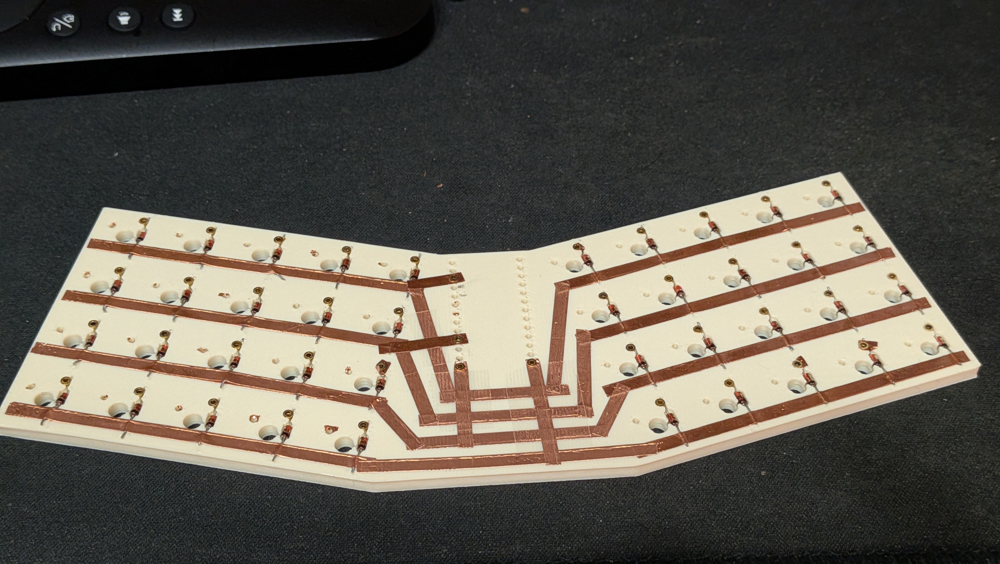
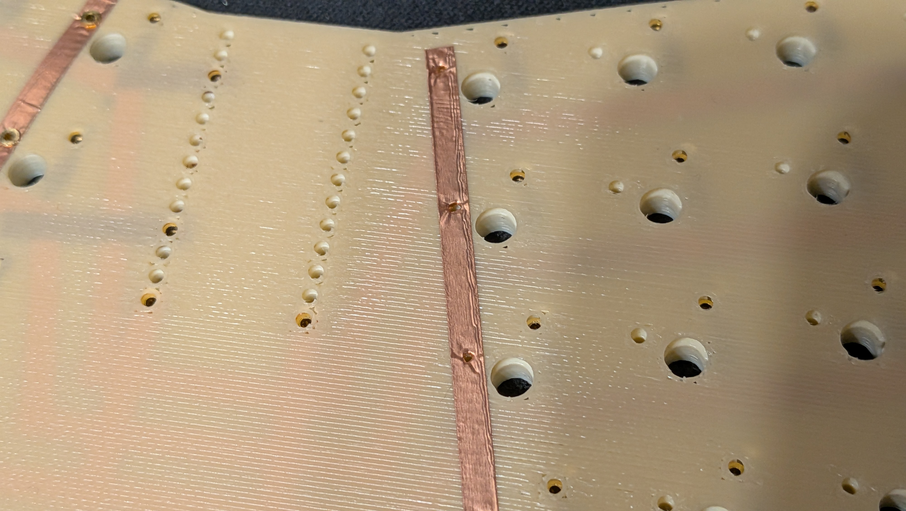
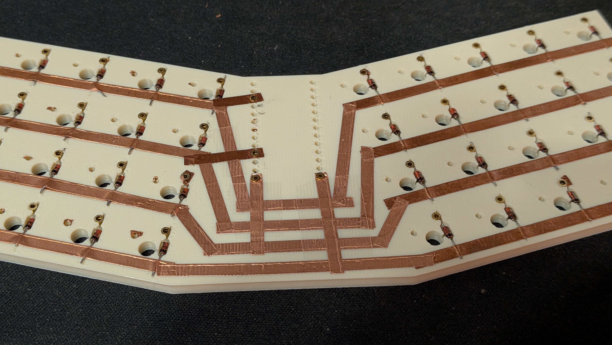

# 免焊接 3D 列印鍵盤接觸結構概念

這個 repo 用來保存一個「不用焊接也能做鍵盤」的概念。

核心想法是把 3D 列印件當成機械式接觸座：在列印底座上預留 pin 或 socket 的插入口，洞口上方或周圍貼銅箔，接著把 pin 硬壓進孔裡。pin 進入時會把銅箔壓在塑膠孔壁上，而 3D 列印塑膠本身的彈性會持續提供接觸壓力。之後需要接上的零件就可以插進這個 pin/socket 使用，不需要焊接。

## 使用材料

- 3D 列印底座
- 銅箔膠帶作為導電走線
- 壓入式 pin、pin socket，或類似彈片接觸件
- 3D 列印塑膠本身的彈性
- 市售鍵盤零件與預焊好的控制器模組

## 參考圖片

pin/socket 參考：

銅箔參考：

原型照片：

## 接觸原理

1. 3D 列印一個有精準孔位的底座。
2. 在底座表面貼上銅箔膠帶，形成鍵盤需要的導電走線。
3. 讓銅箔通過 pin 插入口，或包覆在插入口附近。
4. 把 pin 從孔位硬壓進去。
5. pin 會把銅箔壓向孔壁。
6. 塑膠孔壁因為彈性變形，會持續把 pin 和銅箔壓在一起。
7. 開關、二極體、控制器線材或其他零件就可以插到露出的 pin/socket 上。

簡單說，這個設計是用「壓力」形成電氣連接，而不是用焊錫。

## 為什麼這個概念有趣

一般 DIY 鍵盤通常需要焊接開關、二極體、線材或控制器排針。這個概念嘗試把焊點改成 3D 列印出來的機械接觸結構。

如果做得穩定，可能有幾個優點：

- 不需要烙鐵
- 可以用 3D 列印快速打樣
- 走線可以靠重貼銅箔修改
- 零件可以拆下、替換、重插
- 鍵盤外殼、定位板和接觸結構可以一起設計

## 建議零件方向

- 3D 列印底座與鍵盤定位板
- 銅箔膠帶
- 壓入式 pin、pin socket 或類似彈簧接點
- MX 相容機械軸
- 鍵盤矩陣用二極體
- 預焊好的 microcontroller 模組
- 跳線或可插拔線材
- 螺絲、熱熔銅螺母、卡扣或磁吸結構

## 3D 設計需求

3D 模型需要考慮：

- pin 插入口的孔徑公差
- 讓塑膠可以微幅變形的釋放槽或彈性區
- 銅箔走線需要的平面或淺槽
- 軸體安裝孔或定位板結構
- 控制器模組安裝空間
- 線材走線空間
- 可以測試與更換 pin 的維修空間

孔徑是最重要的設計參數。孔要夠緊，才能讓 pin、銅箔與塑膠之間維持壓力；但也不能緊到讓塑膠裂開或把銅箔刮破。

## 原型紀錄

目前的原型照片放在 `3d/reference-photos/`。

照片中可以看到 3D 列印的鍵盤底座，以及貼在底部的銅箔走線。pin 從預留孔位壓入後，銅箔就成為 row/column 的電氣網路。照片裡的二極體腳、銅箔與孔位展示的是同一個方向：讓列印件負責機械定位，讓銅箔與 pin 負責導電接觸。

目前概念假設：

- 塑膠彈性可以提供足夠接觸壓力
- 銅箔是主要導電路徑
- pin 是可重複插拔的接點
- 一般組裝過程不需要焊接
- 改版時可以只修改 3D 模型與銅箔走線

## Repo 結構

- `README.md` - 主要概念說明
- `3d/` - Fusion 360、STEP/STL、渲染圖與參考照片
- `LICENSE` - 授權文件

## 待驗證事項

- 加入 Fusion 360 原始模型
- 加入可列印 STL 原型
- 製作 pin 孔徑公差測試件
- 補充銅箔走線範例
- 測量接觸電阻
- 測試多次插拔後的可靠度
- 測試熱、濕度與塑膠蠕變是否會降低接觸壓力
