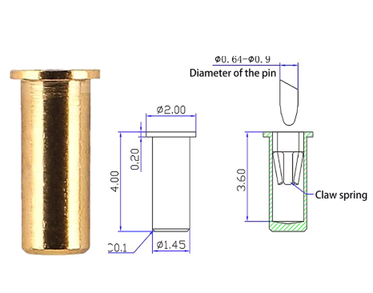
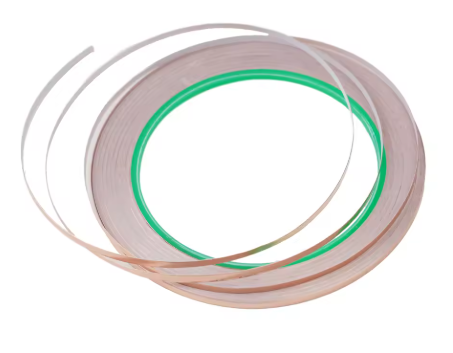

# Solderless 3D-Printed Keyboard Contact Concept

This repository stores the concept for a keyboard that can be built without soldering by combining:

- a 3D-printed base
- copper foil tape used as conductive traces
- press-fit pins or pin sockets
- the natural spring/flex of printed plastic
- off-the-shelf keyboard parts and controller modules

The key idea is to make the 3D-printed part act like a mechanical contact fixture. The printed base has holes for pins. Copper foil is placed over or around the hole. When the pin is pressed into the hole, the plastic flexes and keeps pressure on the pin, while the pin clamps against the copper foil. Components can then be plugged into those pins without soldering.

## Reference Images

Pin/socket reference:

Copper foil reference:

## Mechanism

1. Print a base with accurately sized pin holes.
2. Apply copper foil tape on top of the printed base to create traces.
3. Place the copper foil so it crosses or wraps around each pin-entry hole.
4. Push the pin into the hole.
5. The pin compresses the copper foil against the plastic wall.
6. The elastic force of the printed plastic keeps contact pressure on the pin.
7. Switches, diodes, controller wires, or other parts can be inserted into the exposed pin/socket.

In short: the electrical connection is created by pressure, not solder.

## Why This Is Interesting

Traditional DIY keyboards usually need soldering for switches, diodes, wires, or controller headers. This concept tries to replace those solder joints with a printed mechanical structure.

Benefits if it works well:

- no soldering iron required
- easy to prototype with 3D printing
- traces can be changed by re-taping copper foil
- parts can be removed and replaced
- the keyboard body and contact system can be designed together

## Suggested Parts

- 3D-printed base and switch plate
- copper foil tape
- press-fit pins, pin sockets, or similar spring contacts
- MX-compatible switches
- diodes, if using a keyboard matrix
- pre-soldered microcontroller module
- jumper wires or plug-in leads
- screws, heat-set inserts, or clips for assembly

## 3D Design Requirements

The 3D model should include:

- pin insertion holes with controlled diameter
- small relief gaps so the plastic can flex slightly
- channels or flat areas for copper foil traces
- switch cutouts or switch mounting features
- space for a controller module
- cable-routing paths
- access for testing and replacing pins

The hole size is the most important detail. It should be tight enough to hold the pin and copper foil under pressure, but not so tight that the plastic cracks or the copper foil tears.

## Prototype Notes

The photos for this concept show a printed keyboard base with copper foil traces laid across the bottom side. Pins are pressed through prepared holes, and the copper foil becomes the row/column wiring. The visible diode legs and copper tape demonstrate the same no-PCB direction: the printed body carries the mechanical layout, while copper foil and pins create the electrical network.

Current concept assumptions:

- plastic spring force provides contact pressure
- copper foil is the conductive path
- the pin is the reusable plug-in contact point
- no solder is needed during normal assembly
- the design can be revised by changing the printed base and foil routing

## Repository Structure

- `README.md` - main concept notes
- `3d/` - Fusion 360 files, STEP/STL exports, renders, and reference images
- `LICENSE` - license for the notes and files

## Future Work

- Add Fusion 360 source model
- Add printable STL prototype
- Add pin-hole tolerance test model
- Add copper foil routing examples
- Add photos of the prototype build
- Measure contact resistance before and after repeated insertion
- Test whether heat, humidity, and plastic creep reduce contact pressure over time
